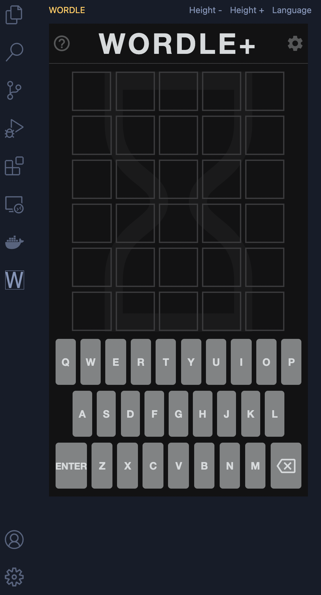

# Wordle for Visual Studio Code

A simple Visual Studio Code extension allowing to play Wordle directly from the editor.

The game is available directly from Visual Studio Code sidebar and the extension allows to load different versions of Wordle.

There is the possibility to adjust manually the height of the container in which the Wordle game is displayed.

## Supported Wordle Games
- [The English original](https://www.powerlanguage.co.uk/wordle/) 
- [German](https://wordle.at)
- [French](https://wordle.louan.me)
- [Polish](https://literalnie.fun)
- [Spanish](https://wordle.danielfrg.com)
- [Italian](https://sebastianomorando.github.io/wordle-it/)
- [Portuguese](https://term.ooo)
- [Arabic](https://arwordle.netlify.app)
- [Russian](https://arwordle.netlify.app)
- [Nerdle (mathematics)](https://nerdlegame.com)
- [Danish](https://www.wørdle.dk)

**This extension only loads the games as they are provided by their respective authors.**

If you want another Wordle to be available just create an issue providing the link to the game you want to add.

